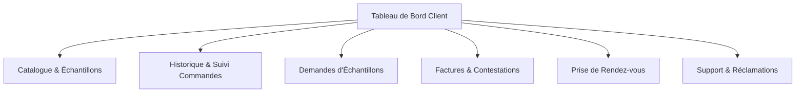
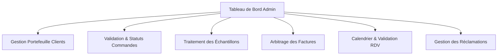

# Product Requirements Document (PRD) : Portail B2B Lesieur Cristal
**Module de Gestion des Commandes, Échantillons, Notifications & Facturation**

---

## 1. Vision et Objectifs B2B de Haute Valeur

L'objectif de ce module est de transformer l'expérience de commande B2B de Lesieur Cristal en fournissant un outil fluide, transparent et interconnecté pour les clients et les administrateurs. 

Pour apporter une **haute valeur ajoutée B2B**, le système relie intelligemment les **échantillons** (phase de test/R&D chez le client) aux **commandes réelles** (achat en gros) afin de mesurer le taux de conversion commerciale et d'optimiser la logistique d'expédition des échantillons.

---

## 2. Brainstorming Fonctionnel et Décisions de Conception

### 2.1 Flux de Sélection Produits et Demandes d'Échantillons
*   **Où le client ajoute-t-il les produits/échantillons ?**
    *   **Catalogue Produits (`/client/catalog`) :** Le client consulte les produits disponibles (huiles de table, huiles d'olive, savons, etc.). L'administrateur gère ce catalogue. Chaque produit possède un indicateur `is_sampleable` (éligible aux échantillons) et une quantité maximale autorisée pour échantillon.
    *   **Actions directes du catalogue :**
        *   *Ajouter au panier* (pour une commande standard).
        *   *Demander un échantillon* (ajoute le produit à la liste des demandes d'échantillons).
*   **Lien logique entre Commandes et Échantillons :**
    *   **Groupement logistique (Économie de transport) :** Lors de la création d'une commande standard, le client peut cocher une case : *"Souhaitez-vous joindre des échantillons à cette livraison ?"*. Le système lui permet de choisir des échantillons éligibles qui seront rattachés à la commande (via `linked_order_number`). Cela évite à Lesieur Cristal de payer des frais d'expédition séparés.
    *   **Suivi de conversion (Haute valeur commerciale) :** Lorsqu'un échantillon donne lieu à une commande en volume plus tard, le système lie la nouvelle commande à la demande d'échantillon d'origine (via `resulting_order_number`). L'admin peut ainsi analyser : *"Quels échantillons ont généré des ventes réelles ?"*.

### 2.2 Système de Notifications Contextuelles et Double Notification
*   **Contexte Admin (Savoir précisément "Qui demande Quoi") :**
    *   Les notifications de l'administrateur ne sont pas de simples alertes génériques. Elles affichent le contexte d'affaires complet :
        *   *Structure :* `[Type d'action] - [Nom Entreprise Client] ([Code Client ERP])`
        *   *Exemple Échantillon :* *"Demande d'échantillon soumise par **SOFAC (Client #10024)**. Produits demandés : **Huile d'Olive Al Horra (2L)**. Contact : **M. Amrani (R&D)**."*
        *   *Exemple Contestation :* *"Facture #F-9876 contestée par **Maroc Distribution (Client #10089)**. Motif : **Écart de quantité (5 cartons manquants)**."*
    *   Chaque notification contient un lien direct (`target_url`) redirigeant l'admin vers la page de traitement spécifique de cette demande.
*   **Double Notification (Client & Admin) sur Changement d'État :**
    *   **Flux Aller (Action Client) :** Le client soumet un formulaire (commande, échantillon, réclamation, rdv) -> Une notification est insérée pour l'admin et poussée sur son tableau de bord.
    *   **Flux Retour (Action Admin) :** L'admin change l'état (ex: *En préparation* -> *Expédié*) -> Une notification est insérée pour le client et affichée instantanément dans son espace client.
    *   **Technologie :** Base de données (`app.notifications`) couplée à un endpoint SSE (Server-Sent Events) ou de rafraîchissement réactif pour l'affichage en temps réel.

### 2.3 Suivi de Commande, Formulaires et Factures
*   **Formulaires avec Progress Bar (Frontend) :**
    *   Les formulaires complexes (Création de commande, Demande de devis/échantillon) sont découpés en étapes claires avec une barre de progression (Stepper).
    *   **Redirection automatique :** Après soumission réussie, un écran intermédiaire affiche une animation de succès (le composant `success-gif.tsx`), reste bloqué pendant **3 secondes**, puis redirige automatiquement l'utilisateur vers son historique ou son suivi en temps réel.
*   **Suivi de commande visuel :**
    *   Une barre de progression graphique montre l'état de la commande : `En attente` ➔ `Confirmée` ➔ `En préparation` ➔ `Expédiée` ➔ `Livrée`.
*   **Facturation et contestations :**
    *   Le client consulte ses factures. Si le montant ou la quantité diverge de la livraison, il remplit un formulaire de contestation directement lié à la facture, bloquant temporairement son statut en `Contestée` et alertant l'admin.

---

## 3. Périmètre des Écrans à Développer

> [!NOTE]
> Les pages de Connexion, Inscription et Profil Entreprise sont déjà traitées et sont donc exclues de ce cahier des charges.

### 3.1 Espace Client



1.  **Tableau de Bord (Dashboard) :**
    *   Résumé des commandes actives avec barre de progression rapide.
    *   Badge de notifications non lues.
    *   Raccourcis rapides : Nouvelle Commande, Demander Échantillon, Contester Facture.
2.  **Catalogue & Échantillons (`/client/catalog`) :**
    *   Grille des produits Lesieur Cristal avec filtres par catégorie.
    *   Bouton "Ajouter au Panier" (Commande) et "Demander Échantillon" (si éligible).
    *   Panier latéral récapitulatif.
3.  **Création de Commande & Liaison Échantillons (`/client/orders/new`) :**
    *   Formulaire multi-étapes (Produits ➔ Logistique/Échantillons à lier ➔ Récapitulatif).
    *   Intégration d'échantillons physiques dans le même colis.
    *   Redirection automatique de 3 secondes avec `success-gif` après validation.
4.  **Historique & Suivi de Commande (`/client/orders` & `/client/orders/[id]`) :**
    *   Liste des commandes (numéro ERP, date, montant net, statut).
    *   Page de détail avec la barre de progression d'état (`OrderStatus` en temps réel).
    *   Téléchargement direct de la facture liée en PDF.
5.  **Suivi des Demandes d'Échantillons (`/client/samples`) :**
    *   Historique des demandes d'échantillons et leur état (Nouveau, En préparation, Expédié, Rejeté).
    *   Option de conversion en commande réelle.
6.  **Factures et Contestations (`/client/invoices`) :**
    *   Liste des factures (Réglée, À régler, Échéance, Contestée).
    *   Formulaire de contestation pour écart de quantité, tarif, ou produit endommagé avec upload de justificatif.
7.  **Prise de Rendez-vous (`/client/appointments`) :**
    *   Calendrier des créneaux libres pour réserver une réunion avec l'Account Manager.
    *   Suivi des statuts (Confirmé, Annulé, À reprogrammer).
8.  **Réclamations & Support (`/client/claims`) :**
    *   Formulaire d'ouverture de ticket (qualité produit, retard logistique) avec numéro de lot obligatoire.

---

### 3.2 Espace Administrateur



1.  **Tableau de Bord Administrateur (Dashboard) :**
    *   Compteurs de performance (KPIs) : Commandes en attente, Échantillons à expédier, Contestations actives, Réclamations urgentes.
    *   Flux de notifications enrichies avec contexte client et redirection rapide au clic.
2.  **Gestion du Portefeuille Clients (`/admin/clients`) :**
    *   Liste complète des clients B2B.
    *   Historique des modifications de fiches clients (`ClientChangeLog`).
    *   Vue détaillée d'un client avec l'historique complet de ses commandes, factures, et réclamations.
3.  **Gestion des Commandes et Statuts (`/admin/orders`) :**
    *   Validation des commandes reçues.
    *   Mise à jour des statuts dans `erp_mock.order_status` (simulant SAP) pour faire progresser la barre de vie de la commande côté client.
    *   Liaison d'une facture générée.
4.  **Traitement des Échantillons (`/admin/samples`) :**
    *   Gestion des demandes d'échantillons en attente de préparation logistique.
    *   Mise à jour du statut logistique.
    *   Liaison d'une demande d'échantillon réussie à une commande ERP finale (`resulting_order_number`).
5.  **Arbitrage des Factures & Contestations (`/admin/invoices`) :**
    *   Liste des factures contestées.
    *   Traitement des contestations (Acceptation et génération d'avoir / Rejet avec commentaire).
6.  **Gestion des Rendez-vous (`/admin/appointments`) :**
    *   Calendrier global des demandes de rendez-vous clients.
    *   Validation, reprogrammation et ajout automatique de liens de visioconférence (Teams/Zoom).
7.  **Centre de Réclamations (`/admin/claims`) :**
    *   Boîte de réception des tickets clients.
    *   Fil de discussion avec le client pour résoudre le problème logistique ou qualité.

---

## 4. Spécifications Techniques Backend (Spring Boot 3.x)

### 4.1 Schéma Relationnel et Migrations Liquibase

#### Modification de `app.sample_requests`
Pour prendre en charge le catalogue de produits existant et la liaison logistique, la table `app.sample_requests` doit être mise à jour pour référencer `app.products`.

```yaml
# ChangeSet Liquibase: modification de la table sample_requests
databaseChangeLog:
  - changeSet:
      id: modify-sample-requests-relation
      author: team-lesieur
      changes:
        - addColumn:
            schemaName: app
            tableName: sample_requests
            columns:
              - column:
                  name: product_code
                  type: VARCHAR(30)
                  constraints:
                    nullable: false
                    foreignKeyName: fk_sample_request_product
                    referencedTableSchemaName: app
                    referencedTableName: products
                    referencedColumnNames: code
              - column:
                  name: linked_order_number
                  type: VARCHAR(20)
                  constraints:
                    nullable: true
                    foreignKeyName: fk_sample_request_order_link
                    referencedTableSchemaName: erp_mock
                    referencedTableName: orders
                    referencedColumnNames: order_number
        - dropColumn:
            schemaName: app
            tableName: sample_requests
            columnName: product_type
```

#### Table de Notifications `app.notifications`
Création d'une table dédiée pour le stockage et la distribution des notifications.

```yaml
# ChangeSet Liquibase: création de la table notifications
databaseChangeLog:
  - changeSet:
      id: create-notifications-table
      author: team-lesieur
      changes:
        - createTable:
            schemaName: app
            tableName: notifications
            columns:
              - column:
                  name: id
                  type: BIGINT
                  autoIncrement: true
                  constraints:
                    primaryKey: true
                    nullable: false
              - column:
                  name: recipient_user_id
                  type: BIGINT
                  constraints:
                    nullable: true # null si destiné à tous les admins
                    foreignKeyName: fk_notification_user
                    referencedTableSchemaName: app
                    referencedTableName: users
                    referencedColumnNames: id
              - column:
                  name: recipient_role
                  type: VARCHAR(20)
                  constraints:
                    nullable: false # CLIENT ou ADMIN
              - column:
                  name: title
                  type: VARCHAR(150)
                  constraints:
                    nullable: false
              - column:
                  name: message
                  type: TEXT
                  constraints:
                    nullable: false
              - column:
                  name: type
                  type: VARCHAR(50)
                  constraints:
                    nullable: false # ORDER_CREATED, STATUS_CHANGED, DISPUTE, etc.
              - column:
                  name: related_entity_type
                  type: VARCHAR(50)
              - column:
                  name: related_entity_id
                  type: VARCHAR(50)
              - column:
                  name: target_url
                  type: VARCHAR(255)
              - column:
                  name: is_read
                  type: BOOLEAN
                  defaultValueBoolean: false
                  constraints:
                    nullable: false
              - column:
                  name: created_at
                  type: TIMESTAMP WITH TIME ZONE
                  defaultValueComputed: CURRENT_TIMESTAMP
                  constraints:
                    nullable: false
```

#### Table de Contestations `app.invoice_disputes`
Création de la table de gestion des contestations de factures.

```yaml
databaseChangeLog:
  - changeSet:
      id: create-invoice-disputes-table
      author: team-lesieur
      changes:
        - createTable:
            schemaName: app
            tableName: invoice_disputes
            columns:
              - column:
                  name: id
                  type: BIGINT
                  autoIncrement: true
                  constraints:
                    primaryKey: true
              - column:
                  name: invoice_number
                  type: VARCHAR(20)
                  constraints:
                    nullable: false
                    foreignKeyName: fk_dispute_invoice
                    referencedTableSchemaName: erp_mock
                    referencedTableName: invoices
                    referencedColumnNames: invoice_number
              - column:
                  name: reason
                  type: VARCHAR(50) # QUANTITY_DISCREPANCY, PRICE_DISCREPANCY, DAMAGED_GOODS, OTHER
                  constraints:
                    nullable: false
              - column:
                  name: description
                  type: TEXT
                  constraints:
                    nullable: false
              - column:
                  name: file_path
                  type: VARCHAR(255) # Justificatif
              - column:
                  name: status
                  type: VARCHAR(20) # PENDING, APPROVED, REJECTED
                  defaultValue: PENDING
              - column:
                  name: created_at
                  type: TIMESTAMP WITH TIME ZONE
                  defaultValueComputed: CURRENT_TIMESTAMP
```

### 4.2 Endpoints REST API (CRUD & Opérations Métiers)

#### Commandes (`/api/orders`)
*   `POST /api/orders` : Soumet une nouvelle commande. Reçoit une liste de codes produits et quantités, ainsi qu'une liste optionnelle d'échantillons à joindre. Enregistre la commande dans le schéma simulé ERP et crée les lignes d'échantillons associées dans `app.sample_requests`.
*   `GET /api/orders` : Liste les commandes du client connecté.
*   `GET /api/orders/{id}` : Détail complet de la commande avec son état logistique (`OrderStatus`).

#### Échantillons (`/api/samples`)
*   `POST /api/samples` : Crée une demande d'échantillon isolée (quantité, adresse, contact, produit validé).
*   `GET /api/samples` : Récupère les demandes d'échantillons (client ou admin).
*   `PUT /api/samples/{id}/status` (Admin uniquement) : Change le statut de l'échantillon. Génère une notification automatique pour le client.
*   `PUT /api/samples/{id}/link-order` (Admin uniquement) : Lie l'échantillon au numéro de commande finale ERP générée (`resulting_order_number`).

#### Factures & Contestations (`/api/invoices`)
*   `GET /api/invoices` : Liste les factures du client connecté.
*   `POST /api/invoices/{invoiceNumber}/dispute` : Déclare une contestation de facture (crée l'enregistrement dans `invoice_disputes`, passe le statut de la facture à `Contestée` et notifie l'admin).
*   `GET /api/admin/invoices/disputes` (Admin uniquement) : Liste les contestations en attente.
*   `PUT /api/admin/invoices/disputes/{id}` (Admin uniquement) : Valide ou refuse la contestation. Modifie le statut de la facture ERP en conséquence.

#### Notifications (`/api/notifications`)
*   `GET /api/notifications` : Récupère les notifications de l'utilisateur connecté (triées par date décroissante, filtrées par rôle).
*   `PUT /api/notifications/{id}/read` : Marque une notification comme lue.
*   `GET /api/notifications/stream` (SSE) : Flux de Server-Sent Events pour pousser en temps réel les notifications sur le client/admin connecté sans polling SQL.

---

## 5. Spécifications Techniques Frontend (Next.js)

### 5.1 Architecture des Composants et UX Premium
Pour satisfaire aux critères d'une **interface B2B haut de gamme**, nous implémentons un système visuel riche avec des couleurs identitaires de Lesieur Cristal (Rouge Profond, Brun Crème, Or Doré) et un thème sombre optionnel.

#### Composant Stepper Progress Bar (`/components/ui/stepper-progress.tsx`)
Affiche la progression d'un formulaire ou l'état de livraison d'une commande.
*   *Propriétés :* `steps: string[]`, `currentStep: number`.
*   *Design :* Cercles animés avec transition CSS de largeur de barre (`duration-500 ease-in-out`), icônes indicatrice et labels sous chaque étape.

#### Animation de Succès et Redirection automatique (`/components/ui/form-success-redirect.tsx`)
Composant affiché après la soumission réussie d'un formulaire.
*   *Effet :* Affiche un état de succès plein écran avec le gif de confirmation (composant `success-gif.tsx`). Un compte à rebours visuel affiche : *"Redirection vers votre suivi de commande dans 3 secondes..."*.
*   *Comportement :* Utilise `setTimeout` pour pousser la route cible via le routeur Next.js (`useRouter().push()`).

### 5.2 Formulaire de Commande Multi-étapes (`/app/client/orders/new/page.tsx`)
*   **Étape 1 : Sélection Produits**
    *   Grille interactive avec sélection des quantités en temps réel. Calcul automatique du montant HT / TTC prévisionnel.
*   **Étape 2 : Échantillons & Logistique**
    *   Boîte de dialogue intelligente : *"Souhaitez-vous optimiser le transport en ajoutant des échantillons gratuits à ce colis ?"*.
    *   Affichage sous forme de carrousel des produits disponibles en échantillons.
*   **Étape 3 : Facturation & Validation**
    *   Sélection de l'adresse de livraison pré-enregistrée, choix du mode de transport, et validation finale.

---

## 6. Feuille de Route d'Implémentation Étape par Étape

### 🟩 Étape 1 : Base de données et Modélisation (Backend)
- [x] Rédiger et exécuter les changesets Liquibase pour `app.notifications`, `app.invoice_disputes`, et la mise à jour de `app.sample_requests`.
- [x] Mettre à jour les entités JPA Spring Boot (`SampleRequest`, `Product`).
- [x] Créer l'entité JPA `Notification` et `InvoiceDispute`.
- [x] Écrire les scripts SQL de données de test (`data-test.sql`) pour peupler le catalogue de produits éligibles et quelques factures simulées dans le schéma `erp_mock`.

### 🟩 Étape 2 : API REST Backend (Spring Boot)
- [x] Développer les contrôleurs et services pour la gestion des commandes (`OrderController` avec logique d'intégration d'échantillons).
- [x] Développer le système de notification (`NotificationService` étendu, endpoint SSE `/api/notifications/stream` et stockage en base).
- [x] Développer les endpoints de contestation de factures.
- [x] Implémenter les règles d'isolation de sécurité (Vérifier que le client connecté ne peut requérir/modifier que ses propres données via son `customer_number` extrait du JWT).

### 🟩 Étape 3 : Composants Réutilisables & Navigation (Frontend Next.js)
- [x] Créer le composant Stepper de progression visuelle.
- [x] Créer le composant d'auto-redirection avec l'animation de succès.
- [x] Intégrer le centre de notifications (Badge dynamique + menu déroulant avec rafraîchissement SSE ou polling intelligent).

### 🟩 Étape 4 : Pages Client (Frontend Next.js)
- [x] Développer la page Catalogue avec sélection de commande et d'échantillons.
- [x] Développer le formulaire de commande multi-étapes.
- [ ] Développer la page de suivi de commande en temps réel avec la barre de progression.
- [ ] Développer la page de gestion des factures et le formulaire de contestation.
- [ ] Développer la page de prise de rendez-vous avec calendrier.

### 🟩 Étape 5 : Pages Administrateur (Frontend Next.js)
- [x] Développer le Dashboard Admin avec les compteurs KPIs et le flux de notifications contextuelles réactives.
- [x] Développer la page de traitement logistique des échantillons.
- [x] Développer la page de traitement des contestations de factures et réclamations.
- [ ] Développer le planificateur de rendez-vous (calendrier partagé admin).

### 🟩 Étape 6 : Tests, Recette et Clôture
- [ ] Effectuer des tests d'intégration de bout en bout (Le client soumet -> L'admin reçoit la notification -> L'admin traite -> Le client reçoit l'alerte de changement d'état).
- [ ] Valider le comportement hors-ligne / erreur de l'API avec des messages explicites en français.

---

## 7. Prompts de Génération IA pour le Développement

> [!TIP]
> Copiez-collez les prompts ci-dessous dans votre assistant de codage pour générer automatiquement le code correspondant à chaque brique technique.

### 🤖 Prompt 1 : Backend Spring Boot 3.x & PostgreSQL (Entités, Repository, Controllers & SSE) ✅ Livré

```text
Tu es un expert Java Spring Boot . Je veux implémenter la couche backend pour le système d'échantillons, de contestation de factures et de notifications contextuelles pour un portail B2B.

Voici les exigences techniques :
1. Crée les entités JPA suivantes dans le package `com.lesieurcristal.b2bportal.entity.app` :
   - `Notification` : id (Long, auto-incrément), recipientUser (User, relation ManyToOne vers app.users), recipientRole (String, "CLIENT" ou "ADMIN"), title (String), message (String), type (String), relatedEntityType (String), relatedEntityId (String), targetUrl (String), isRead (boolean), createdAt (OffsetDateTime).
   - `InvoiceDispute` : id (Long, auto-incrément), invoiceNumber (String), reason (enum : QUANTITY_DISCREPANCY, PRICE_DISCREPANCY, DAMAGED_GOODS, OTHER), description (String), filePath (String), status (enum : PENDING, APPROVED, REJECTED), createdAt (OffsetDateTime).
2. Modifie l'entité `SampleRequest` existante pour y ajouter :
   - Une relation ManyToOne avec `Product` (productCode mappé sur la table products de app).
   - Un champ facultatif `linkedOrderNumber` (String) pour lier logiquement l'échantillon à une commande groupée.
3. Crée les interfaces Spring Data JPA Repository correspondantes :
   - `NotificationRepository` (avec requêtes pour lister par destinataire et rôle, trié par date décroissante).
   - `InvoiceDisputeRepository`.
4. Crée le service `NotificationService` avec :
   - Une méthode `void createNotification(User recipient, String role, String title, String message, String type, String entityType, String entityId, String targetUrl)` qui sauvegarde la notification en BDD et pousse l'événement vers un gestionnaire de flux SSE (Server-Sent Events).
   - Un endpoint SSE public `/api/notifications/stream` sécurisé qui permet à chaque utilisateur connecté de s'abonner pour recevoir ses notifications en temps réel.
5. Développe `OrderController` et `SampleController` avec la logique métier :
   - Lors de la création d'une commande via `POST /api/orders`, si la requête contient des codes produits en échantillons dans le champ `sampleProductCodes`, crée parallèlement des `SampleRequest` associés ayant leur `linkedOrderNumber` égal au numéro de la commande créée. Envoie une notification contextualisée aux admins : "Nouvelle commande #CMD-XXX contenant X échantillons soumise par [Client]".
6. Applique les contrôles de sécurité : chaque client ne peut lister ou modifier que les données liées à son `customerNumber` présent dans le token d'authentification.
génère un code propre, documenté avec Swagger, utilisant Lombok, et prêt pour l'intégration.
```

### 🤖 Prompt 2 : Frontend Next.js (Espace Client - Catalogue, Panier & Stepper Formulaire avec Redirection) ✅ Livré (catalogue + `/orders/new` 3 étapes)

```text
Tu es un développeur frontend senior expert en React, Next.js (App Router) et TailwindCSS. Je veux créer l'espace client pour la sélection de produits, d'échantillons et la soumission de commandes.

Voici les spécifications de l'interface :
1. Crée la page catalogue `/app/client/catalog/page.tsx` :
   - Affiche une grille de produits élégante avec filtre par catégorie.
   - Chaque carte produit affiche un badge "Éligible Échantillon" si le produit possède `is_sampleable = true`.
   - Fournit deux boutons : "Ajouter au Panier" et "Demander Échantillon".
   - Un panier latéral récapitule les deux types de sélections (Produits pour commande d'un côté, Échantillons de l'autre).
2. Crée le formulaire de commande multi-étapes `/app/client/orders/new/page.tsx` :
   - Utilise un stepper de progression visuel (`Étape 1 : Produits` ➔ `Étape 2 : Échantillons & Transport` ➔ `Étape 3 : Validation`).
   - À l'étape 2, si le client a sélectionné des échantillons, propose de les regrouper dans la même livraison. S'il n'en a pas sélectionné, affiche une section interactive "Profitez de cette expédition pour tester des produits gratuitement" avec un carrousel de produits échantillonnables.
   - À l'étape 3, affiche un récapitulatif complet des coûts estimés (quantités, unités de vente nettes) et adresse de livraison.
3. Crée le composant de succès et de redirection `/components/ui/form-success-redirect.tsx` :
   - Après la soumission réussie de la commande via l'API, affiche un état de succès plein écran avec le gif de confirmation (composant `success-gif.tsx`).
   - Affiche un message : "Votre commande a été transmise avec succès à l'ERP de Lesieur Cristal. Redirection vers votre suivi dans 3 secondes...".
   - Gère le compte à rebours et la redirection automatique vers `/client/orders` en utilisant les hooks Next.js.
Assure un design ultra premium B2B (couleurs chaleureuses rouge/brun/crème, typographie raffinée, micro-animations sur les boutons de sélection, responsive mobile).
```

### 🤖 Prompt 3 : Frontend Next.js 14+ (Espace Admin - Dashboard de traitement, Notifications contextuelles SSE & Arbitrage) ✅ Livré (dashboard + `/admin/samples` + `/admin/disputes` + `/admin/claims`)

```text
Tu es un développeur frontend senior expert en Next.js 14 (App Router) et TailwindCSS. Je veux créer l'interface d'administration pour la gestion des commandes, échantillons, et contestations de factures.

Spécifications de l'interface Admin :
1. Crée le Tableau de bord Admin (`/app/admin/dashboard/page.tsx`) :
   - Affiche 4 compteurs KPIs animés en haut de page : Commandes en attente de validation, Demandes d'échantillons à préparer, Contestations de factures actives, Réclamations client en attente.
   - Implémente un panneau latéral droit ou une section centrale pour le flux de "Notifications Réactives" en temps réel. Ce panneau se connecte à l'endpoint SSE `/api/notifications/stream` du backend.
   - Les notifications doivent être hautement contextuelles (ex: "Le client [Nom] a contesté la facture [Num] pour motif [Raison]"). Chaque carte de notification doit être cliquable et rediriger vers la route de traitement correspondante (ex: `/admin/invoices/disputes/[id]`).
2. Crée la page de traitement des échantillons (`/app/admin/samples/page.tsx`) :
   - Liste sous forme de table triable/filtrable les demandes d'échantillons.
   - Permet à l'admin de cliquer sur une ligne pour ouvrir un panneau latéral (Drawer) affichant le contact client, l'adresse de livraison demandée et le produit associé.
   - Fournit des boutons d'action rapide pour faire progresser le statut : "Lancer la préparation" ➔ "Expédier".
   - Permet à l'admin de renseigner le champ "resulting_order_number" lorsqu'une commande réelle découle de cet échantillon pour boucler la boucle d'analyse commerciale B2B.
3. Crée la page de gestion des contestations de factures (`/app/admin/invoices/disputes/page.tsx`) :
   - Permet de consulter les pièces jointes/justificatifs d'écarts de livraison soumis par les clients.
   - Permet de valider la contestation (déclenche une requête API qui génère un avoir ERP fictif) ou de rejeter avec un motif textuel envoyé en notification de retour au client.
Applique un design professionnel, clair, optimisé pour les opérations quotidiennes rapides (mode sombre optionnel, tableaux à chargement progressif, filtres persistants).
```
